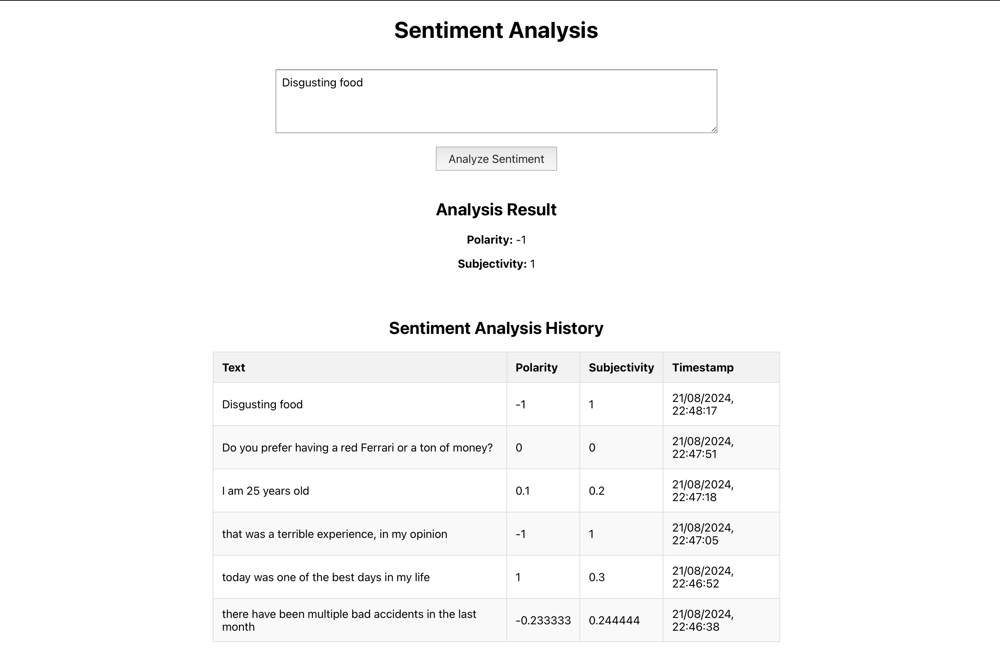

# Sentiment Analysis task
Web App solution for a simple *sentiment analysis* task.
- `Backend` module developed in **Flask** (Python) exposing REST APIs to perform sentiment analysis and fetch requests' history
- `Frontend` module developed in **React** (Javascript) offering a simple UI to perform *sentiment analysis* on a custom sentence and visualizing the requests' history
- `MySQL` relational **DB** to save results history
- Processes hosted on `Docker` containers and use of **docker-compose** configuration to orchestrate them

## Configuration

### Prerequisites
- **Docker** installed in your machine

### Execution
To run the project you must:
1. Open the terminal and navigate to the project folder (sentiment-analysis-task).
2. Then execute the following docker command to build and run the entire project (both BE+FE):
```shell
docker-compose up --build
```
3. Open your browser and navigate to *http://localhost:3000* to use the web app and perform a sentiment analysis task


## Project structure
The docker command is in charge of building the three Docker services into three separate **containers** as specified in the `docker-compose.yml` file:
- **backend**: backend module in Flask exposing the REST APIs
- **frontend**: frontend module in React for the UI/UX
- **mysql**: instance of mysql DB

### Backend
The backend module is exposed on `localhost:5001`, and offers just one endpoint at `/api/sentimentanalysis` to both perform the ML task and fetch the history:
- a **POST** request is handled as a sentiment analysis query, and it is expected to have a JSON body with a 'text' attribute, containing the input text to analyze;
- a **GET** request is handled as a query to retrieve the entire history of requests, and it is not expected to have any kind of body
Note that the default Flask port (5000) has not been used for convenience, just because on Mac machines this port is used by default for other OS purposes.

### Frontend
The frontend module is exposed on `localhost:3000`, on the default React port, and offers a simple web page to enter a custom text and perform sentiment analysis on it. The lower part of the page also contains a table showing all the made request in reversed chronological order.

### MySql
This module contains just a local instance of a `mysql` relational database, to persistently store data about the requests which have been made by the user. The instance contains just a db with a single table named `sentiment_analysis_record`, containing one row for each made request, each with the input text, polarity, subjectivity and a timestamp.


## Usage
The following image shows an example of UI for the sentiment analysis web app



To perform a sentiment analysis task:
1. type your input sentence in the text box
2. Press the *Analyze Sentiment* button
3. The result will appear just right below the text box, showing two metrics:
    - **Polarity**: a value defining how much positive (+) or negative (-) is the sentiment of the sentence. It is a value between -1 (strongly negative sentiment) and +1 (strongly positive sentiment);
    - **Subjectivity**: a value defining how much subjective is the meaning of the sentence. It is a value between 0 (completely objective, based on facts) and +1 (completely subjective, based on feelings);
4. You will also see the result as the last committed entry in the requests' history table

## Host on AWS
In order to host the entire project on the AWS cloud, the following high-level steps can be followed:
1. A proper AWS account must be set up, to have access to its cloud services
2. An EC2 machine instance must be configured, in order to host the project's Docker containers
3. Once the EC2 machine has been started (and properly configured), you must connect to it with ssh from your local machine
4. Then the necessary dependencies must be installed. In this case we just need *docker* and *docker-compose*, and *git* if we want to clone the project directory directly from the cloud machine
5. Once docker has been installed, it must be also started on the machine
6. After that, the project files must be uploaded. This can be done with a secure copy from the local machine, or (better) cloning the project's git repository on the machine itself
7. Follow the steps in the Configuration section to run the project (navigate to the project directory + build/start docker containers with docker-compose command)